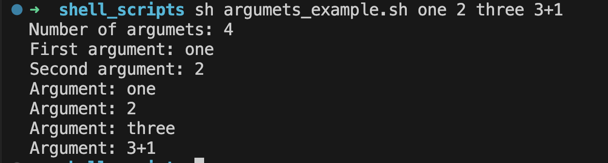
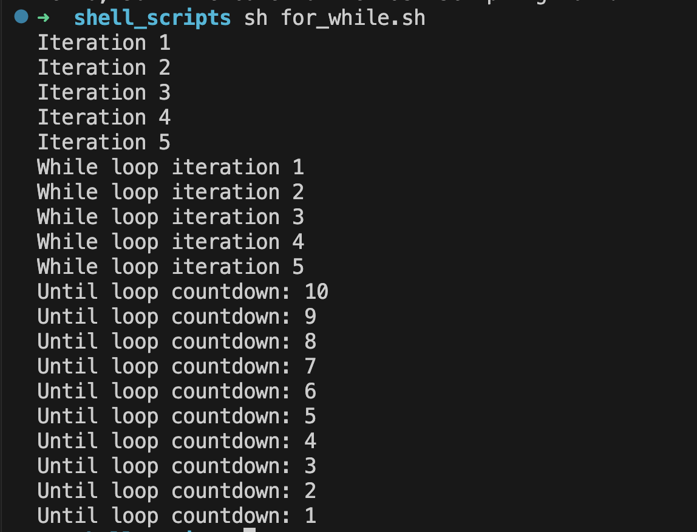

# Linux Automation

See **video** **[Linux Automation by DevOps01](https://youtu.be/FypODsQxJWI?si=r9ifRBLtRnfyrzpu)**.

## Arguments Example

Create file:

```bash title="argumets_example.sh"
echo "Number of argumets: $#"

echo "First argument: $1"
echo "Second argument: $2"

for arg in "$@"; do
    echo "Argument: $arg"
done
```

Run script in console with 4 arguments:

```bash
sh argumets_example.sh one 2 three 3+1
```

See the result:



## Vars Example

Create file:

```bash title="vars.sh"
name="Alice"
age=30

echo "My name is $name and I am $age years old."

num1=10
num2=5
sum=$((num1 + num2))

echo "The sum of $num1 and $num2 is $sum."
```

Run script in console:

```bash
sh vars.sh
```

See the result:


## Function Example

Create file:

```bash title="func.sh"
greet_user() {
    local name=$1
    echo "Hello, $name! Welcome to the Bash scripting world!"
}

greet_user "John"
```

Run script in console:

```bash
sh func.sh
```

See the result:


## Loops Example (for, while, until)

Create file:

```bash title="for_while.sh"
for i in {1..5}; do
    echo "Iteration $i"
done

count=1
while [ $count -le 5 ]; do
    echo "While loop iteration $count"
    ((count++))
done

number=10
until [ $number -eq 0 ]; do
    echo "Until loop countdown: $number"
    ((number--))
done
```

Run script in console:

```bash
sh for_while.sh
```

See the result:



