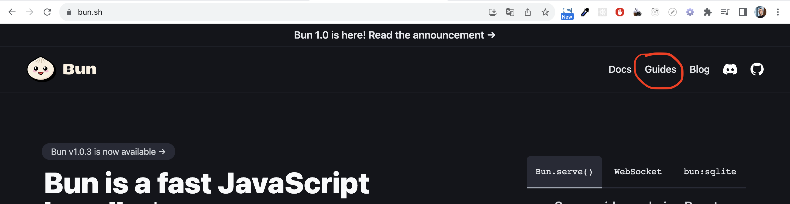
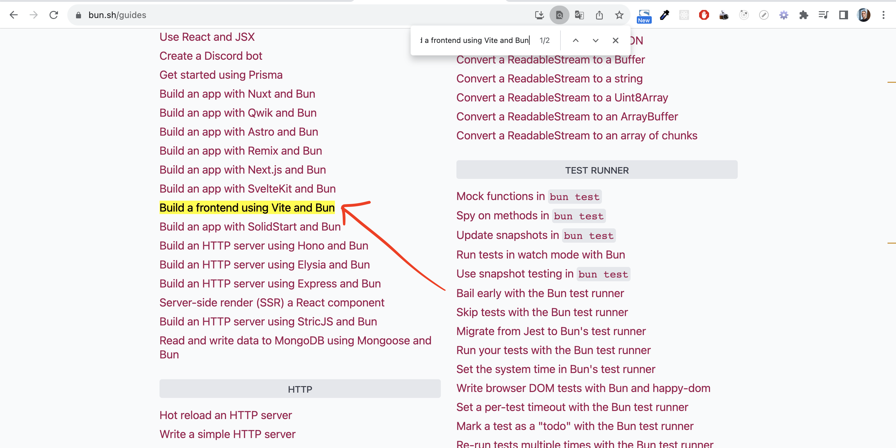
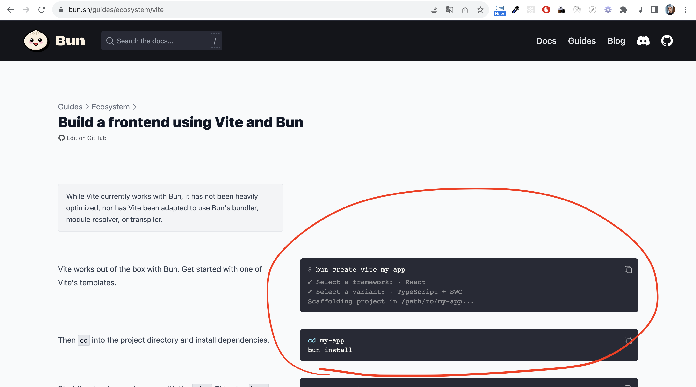
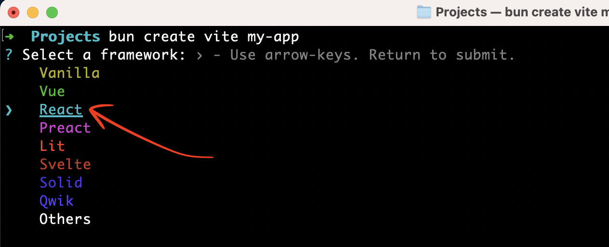
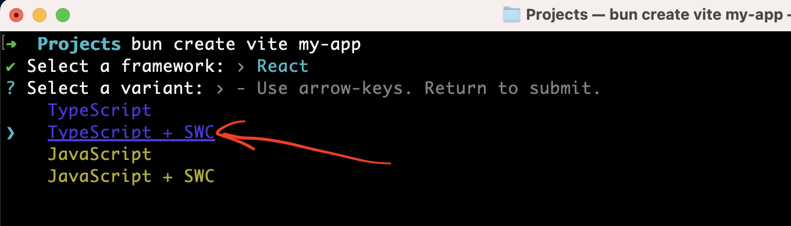
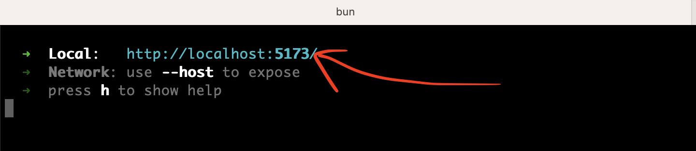
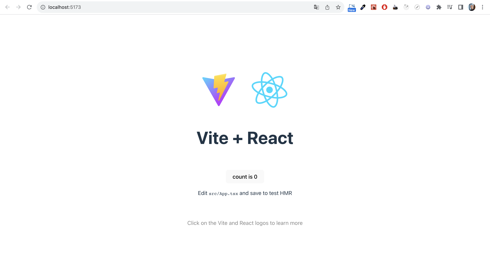
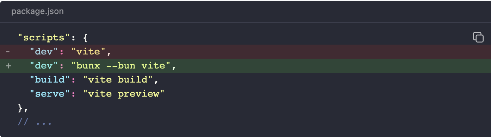

# Run vite app

## 1) Go to Guides page:
[https://bun.sh/guides](https://bun.sh/guides)



## 2) Find section:
Find section "Build a frontend using Vite and Bun" and click to link:

[https://bun.sh/guides/ecosystem/vite](https://bun.sh/guides/ecosystem/vite)


## 3) We will use this page to build application:



### 3.1) Run this command to start creating application process:

```shell
bun create vite my-app
```
Where `my-app` is your desired application name.
* Choose React:

* Then choose Typescript + SWC:


### 3.2) Go to app folder, install dependencies and run application:
```bash
cd my-app
bun install

bunx --bun vite
```

* Open this link in browser:


* You should see something like this:


## Other

* You can change dev command in package.json to this command:
`bunx --bun vite`

and run the application with this command:
`bun run dev`
