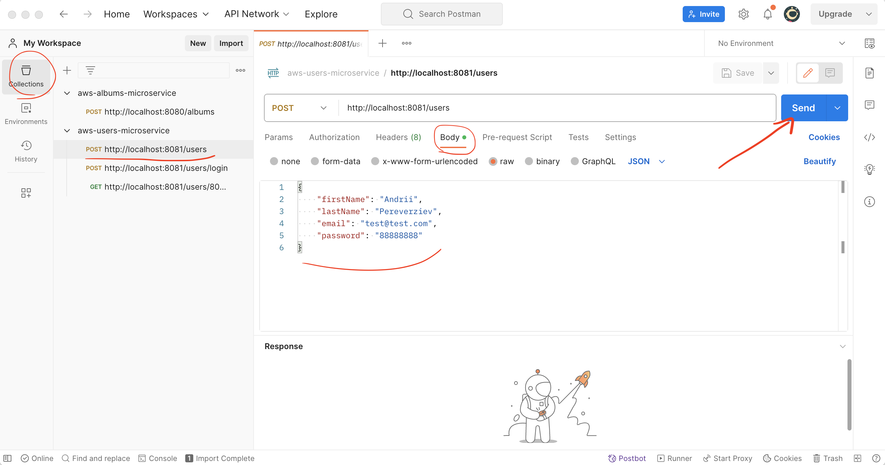
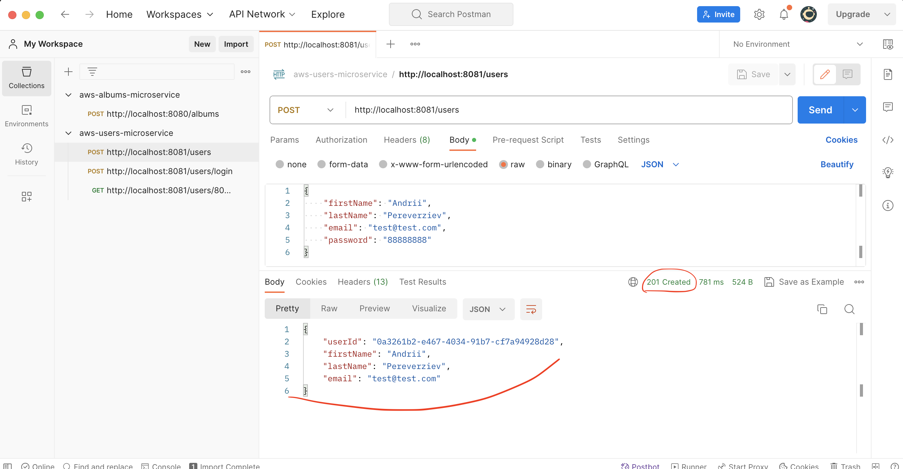

# Test endpoints in services using POSTMAN

## 1) Import collections to POSTMAN:

- Import **aws-users-microservice.postman_collection.json**

1. Choose in postman topmenu **File -> Import**
2. Select file **aws-users-microservice.postman_collection.json** in folder aws-ecs-course-users-microservice and click "Open"

- Import **aws-albums-microservice.postman_collection.json**

1. Choose in postman topmenu **File -> Import**
2. Select file **aws-albums-microservice.postman_collection.json** in folder aws-ecs-course-users-microservice and click "Open"

## 2) Use collections for testing endpoints

- Create user
1. Send data to endpoint **POST http://localhost:8081/users** using "Send" button

2. See the response
