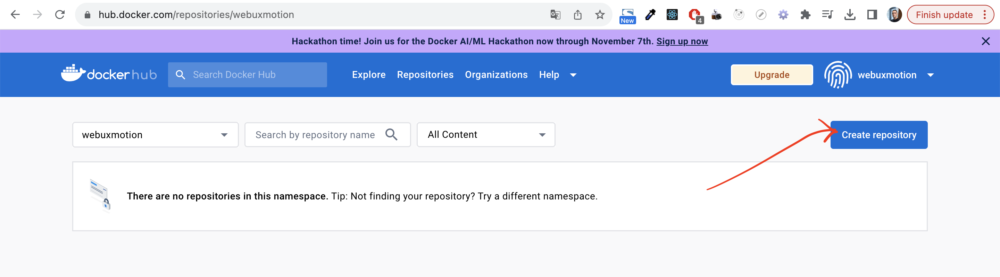
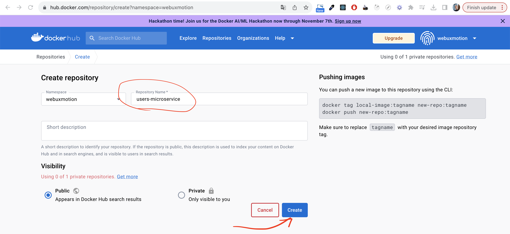
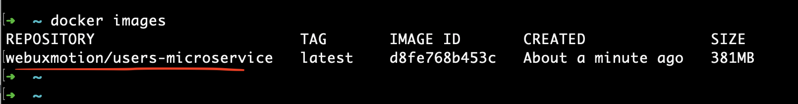
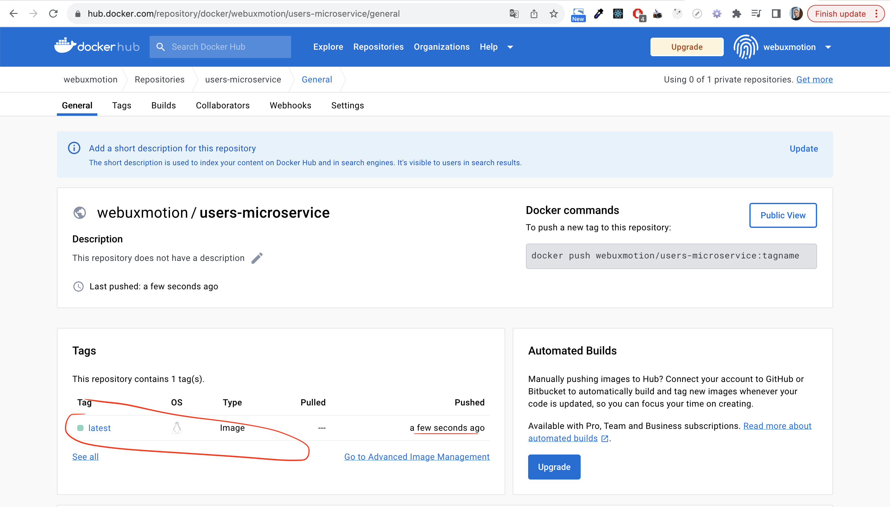

# !OPTIONAL. Docker HUB





```bash
mvn clean package
docker build --tag=webuxmotion/users-microservice --force-rm=true .
docker images
```



```
docker push webuxmotion/users-microservice
```
- Go to docker hub to check the image was pushed
