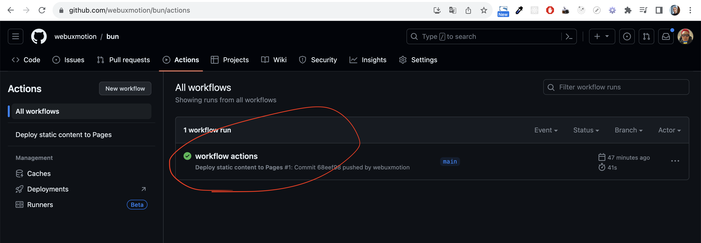
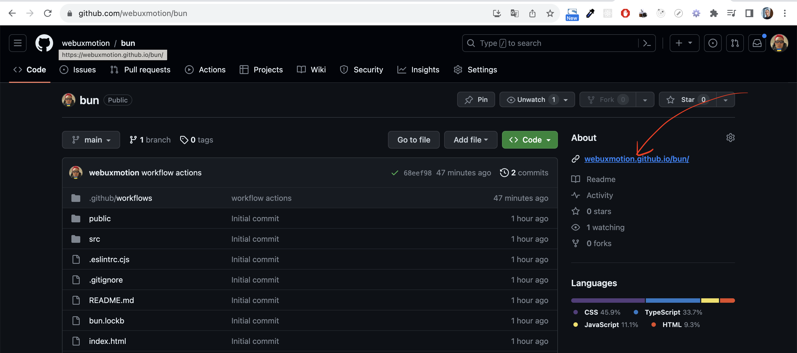

# Check the site

## Open repository site
* Click "Actions" tab
* Check the deployment was successfull (green checkbox icon)

* Click "Code" tab
* Follow this link to see your site hosted by GitHub Pages:

## The End!