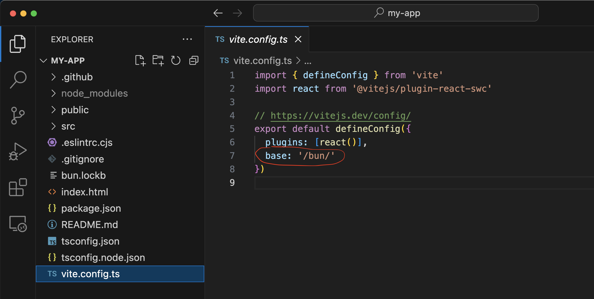
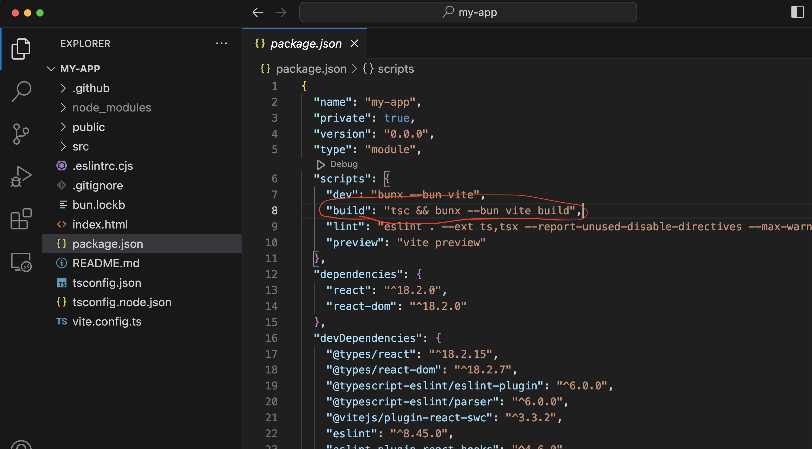
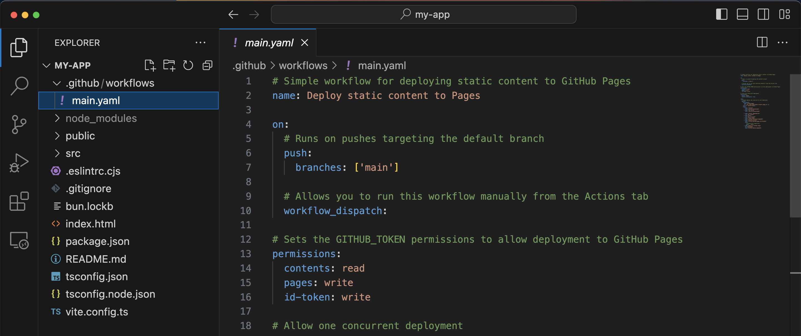

# Edit application

## 1) Edit vite.config.ts
```
base: '/bun/'
```
Where "bun" - the repository name



## 2) Edit package.json
```
"build": "tsc && bunx --bun vite build",
```


## 3) Create folders 
* .github
* .github/workflows

## 4) Create file main.yaml in folder .github/workflows
```yaml
# Simple workflow for deploying static content to GitHub Pages
name: Deploy static content to Pages

on:
  # Runs on pushes targeting the default branch
  push:
    branches: ['main']

  # Allows you to run this workflow manually from the Actions tab
  workflow_dispatch:

# Sets the GITHUB_TOKEN permissions to allow deployment to GitHub Pages
permissions:
  contents: read
  pages: write
  id-token: write

# Allow one concurrent deployment
concurrency:
  group: 'pages'
  cancel-in-progress: true

jobs:
  # Single deploy job since we're just deploying
  deploy:
    environment:
      name: github-pages
      url: ${{ steps.deployment.outputs.page_url }}
    runs-on: ubuntu-latest
    steps:
      - name: Checkout
        uses: actions/checkout@v3
      - name: Set up Bun
        uses: oven-sh/setup-bun@v1
       
      - name: Install dependencies
        run: bun install
      - name: Build
        run: bun run build
      - name: Setup Pages
        uses: actions/configure-pages@v3
      - name: Upload artifact
        uses: actions/upload-pages-artifact@v1
        with:
          # Upload dist repository
          path: './dist'
      - name: Deploy to GitHub Pages
        id: deployment
        uses: actions/deploy-pages@v1
```


## 5) Push changes
```bash
git add .
git commit -m "workflow config"
git push
```

### Some links:

* [
Install dependencies with Bun in GitHub Actions](https://bun.sh/guides/install/cicd)
* [Deploying a Static Site | GitHub Pages](https://vitejs.dev/guide/static-deploy.html#github-pages)
