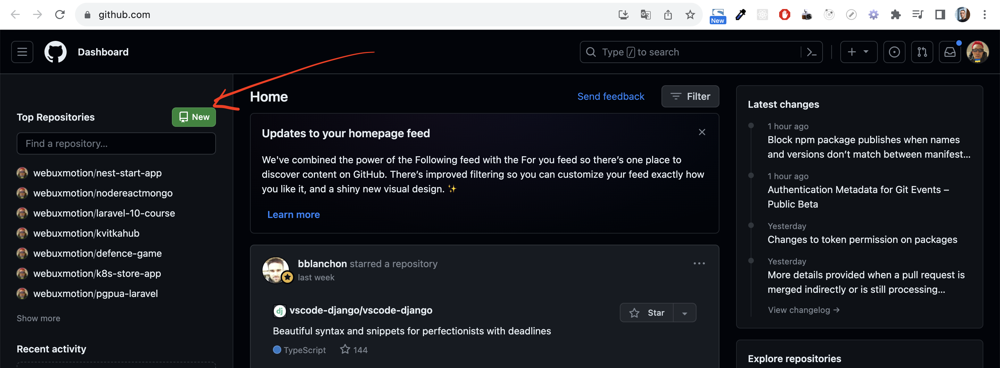
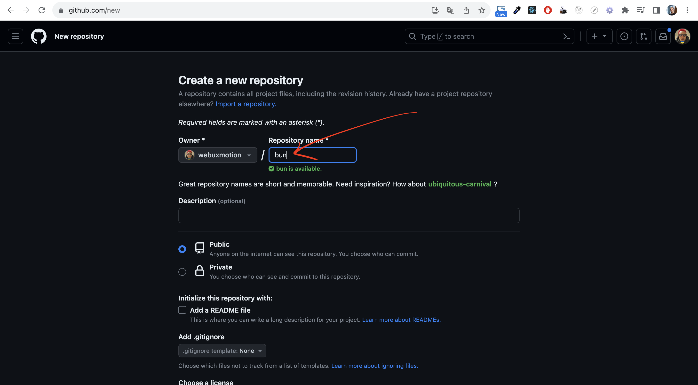
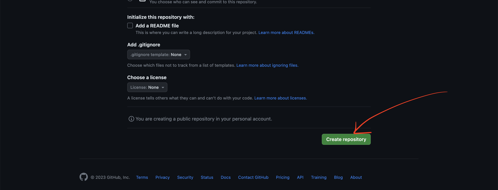
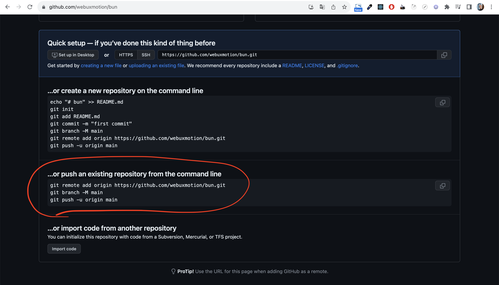

# Github Initial Commit

## 1) Create repository on github

* Follow www.github.com and push "New" button:

* Enter repository name

* And push "Create repository" button:

* You will see this commands:


## 2) Commit and push our site to github
```bash
git init
git add .
git commit -m "Initial commit"
git remote add origin https://github.com/webuxmotion/bun.git
git branch -M main
git push -u origin main
```
Where https://github.com/webuxmotion/bun.git is your repository link in command `git remote add origin https://github.com/webuxmotion/bun.git`
* Find the right command here (on your repository site):
