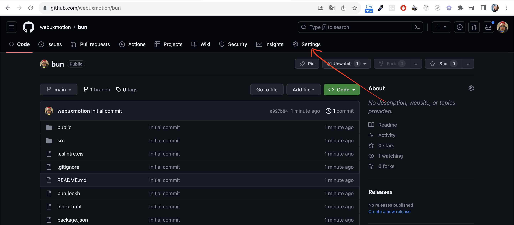
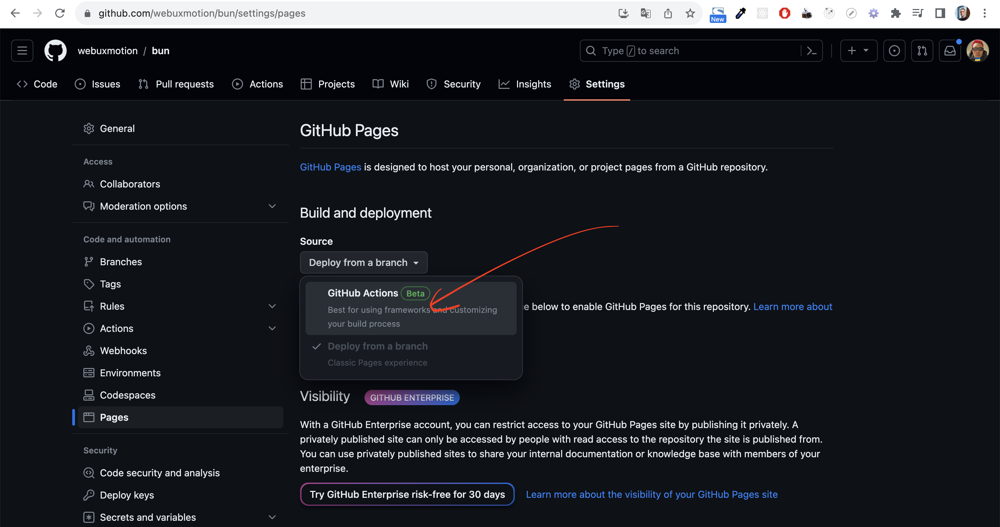
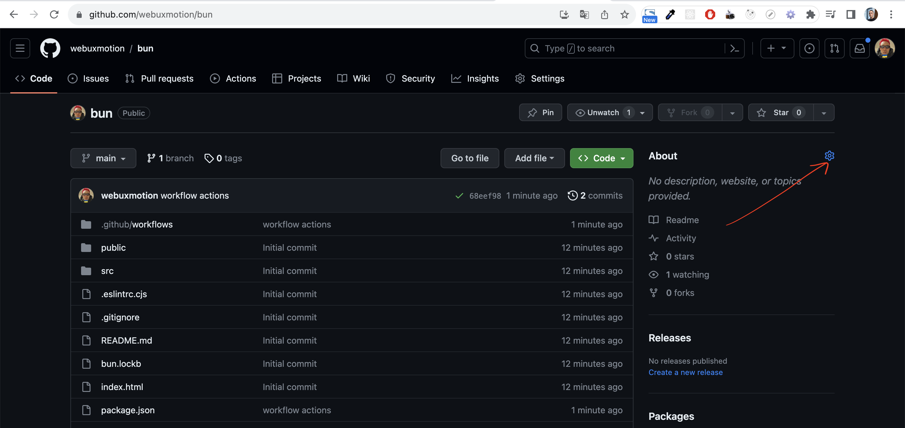
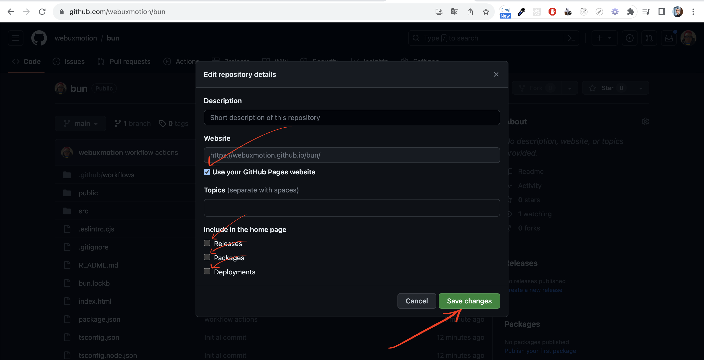

# Github Settings

## 1) Go to github repo and follow steps:

* Go to Settings:

* Push "Pages" button in sidebar

* Select "GitHub Actions" option

## 2) Return to github repo and follow steps:
* Click this icon:

* Check the modal
* Make sure the "Use your GitHub Pages website" checkbox is checked
and other three checkboxes (Releases, Packages, Deployments) are unchecked.
* Click "Save changes"

